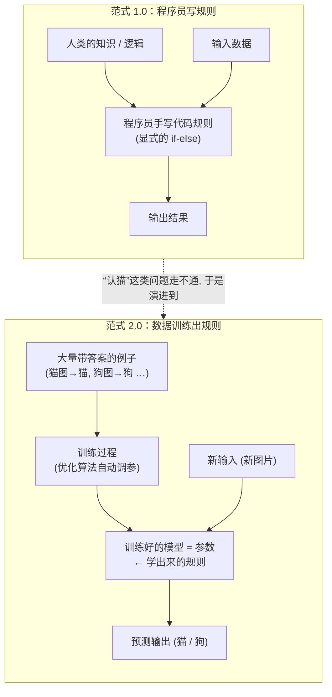
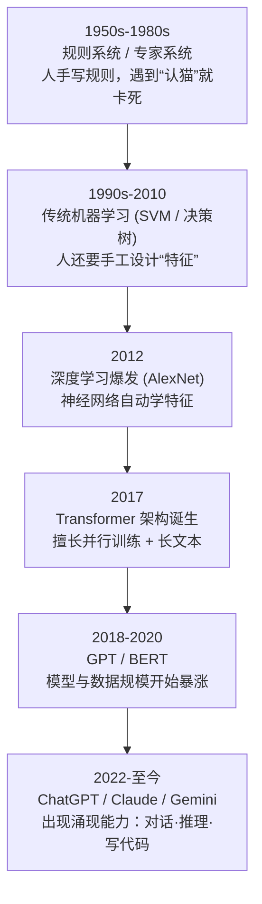
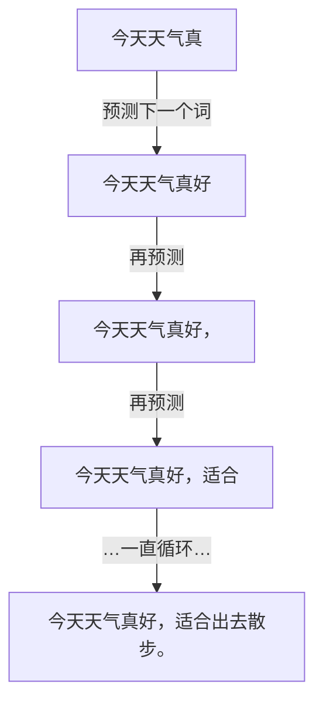
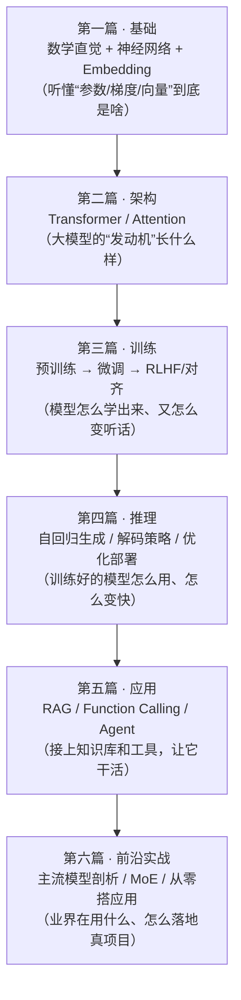

# 第 1 章 从传统软件到大模型：范式的转变

> **本章目标**：让你——一个会写代码的工程师——从根子上理解"大模型到底和传统程序有什么不同"。读完本章，你会明白为什么"写规则"这条路走不通，为什么"喂数据"成了主流，以及大模型在整个软件世界里到底站在什么位置。这是全书的地基，后面所有的 Transformer、训练、推理、Agent，本质上都是本章思想的展开。

---

## 1.1 一个让所有程序员都栽跟头的小任务

我们先不谈"大模型"这种听起来很唬人的词。来做一道你熟悉的题：**写一个函数，判断一张图片里是不是一只猫。**

```python
def is_cat(image) -> bool:
    # 请你用传统方式实现它
    ...
```

作为一个训练有素的程序员，你的第一反应可能是"分解需求，写规则"：

- 猫有两只尖耳朵 → 那我检测三角形轮廓？
- 猫有胡须 → 那我找细长的白线？
- 猫有毛 → 那我分析纹理？

你写着写着就会崩溃。因为：

- 侧脸的猫看不到两只耳朵；
- 无毛猫（斯芬克斯）没有毛；
- 橘猫、黑猫、布偶猫的颜色纹理完全不同；
- 照片可能模糊、逆光、只露出半张脸；
- 一团黑影在沙发上，是猫还是靠垫？

你会发现：**"猫"这个概念，你自己一眼就能认出来，却写不出精确的规则。** 这不是你能力不行，而是这类问题**本质上无法用"if-else 规则"穷举**。

这就是传统软件与大模型的分水岭。传统软件擅长解决**规则清晰**的问题；而"认猫""听懂人话""写文章"这类问题，规则藏在海量的例子里，人类自己都说不清，只能"看多了自然就会"。

> 🔑 **核心洞察**：有一类问题，**逻辑无法显式描述，但可以从大量例子中学习出来**。这类问题正是机器学习、也是大模型要解决的。

---

## 1.2 两种编程范式：写规则 vs. 喂数据

我们把传统软件叫 **编程范式 1.0（Software 1.0）**，把机器学习叫 **编程范式 2.0（Software 2.0）**。这个说法由特斯拉前 AI 总监 Andrej Karpathy 提出，非常适合程序员理解。两者的根本差异见下图：



> 📖 **关于本书的图**：像上面这样的框图用 **Mermaid** 写成，在 GitHub、VS Code、Typora、mdBook 等环境会自动渲染成真正的流程图；导出 PDF/EPUB 时同样会渲染。少数需要精确数据的图（如概率分布、损失曲线）则用 Python 生成为 PNG 图片，见 1.7 节。

### 范式 1.0：程序员写规则

在这个世界里，**逻辑是人写死的**。程序 = 程序员把自己脑子里的规则翻译成代码。输入数据，程序按规则计算，吐出结果。你调试的是"我的逻辑对不对"。

### 范式 2.0：数据"训练"出规则

在这个世界里，**逻辑不是人写的，是"训练"出来的**。你不再直接写"怎么认猫"的规则，而是：

1. 准备大量例子：几百万张图片，每张都标注好"猫/狗/汽车……"；
2. 搭一个可调参数的"模型"（先当黑盒，就是一个含有海量旋钮的数学函数）；
3. 用一个"训练算法"自动拧这些旋钮，让模型在这些例子上尽量答对；
4. 拧到一定程度，模型就"学会"了认猫——即使是它从没见过的新猫图。

> 📌 **一句话对比**：
> - **范式 1.0**：`程序 = 逻辑(人写) + 数据`
> - **范式 2.0**：`程序 = 模型结构(人设计) + 参数(数据训练出来)`
>
> 在 2.0 里，**数据和训练过程"编写"了程序的核心逻辑**，程序员退居二线，只负责设计模型结构和准备数据。

### 用一个你熟悉的类比

传统编程像**教一个厨师做菜**：你给他一份精确到克的菜谱（规则），他严格照做。

机器学习像**培养一个厨师的味觉**：你让他尝了一万道"好吃"和"难吃"的菜（数据），他慢慢形成了自己的判断力（参数）。之后遇到一道新菜，他不需要菜谱，凭"感觉"就知道好不好吃。这个"感觉"你没法写成代码，但它确实存在于他脑子里——对应模型里那些训练出来的参数。

---

## 1.3 从"机器学习"到"大模型"，中间发生了什么

上一节讲的是广义的机器学习。那"大模型"（Large Language Model，LLM）又特殊在哪？我们捋一条时间线，你会看到这是一个**量变引起质变**的过程。



这条线里有三个关键跃迁，你必须理解：

**跃迁一：从"人工设计特征"到"自动学习特征"（深度学习）。** 早期机器学习，人还得告诉模型"该看哪些特征"（比如认猫要看耳朵、胡须）。深度学习用**多层神经网络**，让模型自己从原始数据里逐层提炼特征——底层学边缘、中层学纹理、高层学"这是耳朵"。人终于不用手工设计特征了。

**跃迁二：从"专用架构"到"通用架构 Transformer"。** 2017 年 Transformer 出现，它有一个杀手锏：**能高效并行训练，且擅长捕捉长距离依赖**（后面章节会详细拆）。这让"把模型堆到几百亿参数、用整个互联网的文本来训练"在工程上变得可行。

**跃迁三：从"小模型"到"大模型"，出现涌现能力。** 当模型参数量和训练数据量都堆到某个量级，模型突然表现出小模型完全没有的能力——比如**多步推理、按指令做事、举一反三**。这种"量变到质变"的现象叫 **涌现能力（Emergent Abilities）**，是第 11 章的重点。

> 🔑 **"大模型"的"大"体现在三个维度**：
> 1. **参数量大**：从百万级到千亿级（GPT-3 有 1750 亿参数）；
> 2. **数据量大**：训练语料是几万亿个词（相当于读完整个互联网的文本）；
> 3. **算力大**：训练一次要成千上万张 GPU 跑几周甚至几个月。

---

## 1.4 大语言模型的本质：一个"超级接龙机器"

现在揭开 ChatGPT 最核心的秘密。你可能觉得它很智能、会思考，但它的底层机制简单到令人吃惊：

> 🎯 **大语言模型做的唯一一件事，就是：给定前面的一段文字，预测下一个词最可能是什么。**

就这么简单。它是一个**概率接龙机器**。

举个例子，输入：

```
"今天天气真"
```

模型内部会算出下一个词的概率分布：

```
下一个词        概率
─────────────────────
好             0.62
不错           0.15
热             0.10
冷             0.08
香蕉           0.0001
...            ...
```

把它画成柱状图会更直观（下图由 [assets/ch01/gen_next_token_prob.py](../assets/ch01/gen_next_token_prob.py) 生成）：


可以看到，模型把绝大部分概率押在了"好"上，而"香蕉"这种放进去完全不通顺的词，概率低到几乎为零——这正是模型"懂中文该怎么接"的体现。

然后它挑一个（通常挑高概率的）"好"，接到后面变成 `"今天天气真好"`，再把这整句当输入，继续预测下一个词……如此循环，一个词一个词地"吐"出来，就成了完整的回答。



这个"一个词接一个词往外蹦"的过程，叫 **自回归生成（Autoregressive Generation）**，是第 16 章的核心。

### 等等，就这？它怎么会写代码、会推理？

好问题。关键在于：**为了把"预测下一个词"这件事做到极致准确，模型被迫学会了海量的世界知识和逻辑。**

想想看，要准确预测下面这句的最后一个词：

```
"水在标准大气压下沸腾的温度是 100 ___"
```

模型要答对"度"（或"摄氏度"），它就得"知道"这是个物理常识。再比如：

```
"def add(a, b):\n    return a ___"
```

要预测出 `+ b`，它就得"懂"一点编程语法。

当你逼一个模型在几万亿个词上把"预测下一个词"做到极致，它为了降低预测错误，**不得不在参数里压缩进语法、常识、逻辑、代码规则、甚至一定的推理能力**。所谓的"智能"，是它为了完成接龙任务而"顺带"学会的副产品。

> 💡 **一个绝妙的类比**：这就像你逼一个学生去背几万亿道"完形填空"，一开始他靠死记硬背，但题目实在太多、太杂，死记硬背根本背不完。为了做对题，他被迫总结出语法规律、常识、逻辑——最后他不是"背会"了，而是真的"理解"了语言。大模型走的就是这条路。

我们会在后续章节反复回到这个本质。**无论 ChatGPT 看起来多智能，剥开外壳，核心永远是"预测下一个词"。** 记住这句话，很多困惑会迎刃而解（比如它为什么会"一本正经地胡说八道"——因为它在预测"最像那么回事的词"，而不是"最真实的词"）。

---

## 1.5 传统软件工程师转型：哪些技能能复用，哪些要重建

这本书是写给你的——一个有传统开发经验的工程师。我很清楚你现在最关心的是：**我的经验还有用吗？我要从零开始吗？**

好消息是：**你有巨大的优势，很多技能直接复用。** 我们列个清单。

### ✅ 可以直接复用的能力

| 传统开发能力 | 在大模型领域的对应用途 |
|---|---|
| 编程能力（Python 尤佳） | 写训练/推理/数据处理脚本，几乎所有工作都要写代码 |
| 工程化思维（模块化、抽象） | 搭建 LLM 应用、Agent 系统、RAG 管线 |
| 调试与排错能力 | 训练不收敛、推理结果异常时的排查 |
| API 设计与系统架构 | 把大模型能力封装成服务、设计推理系统 |
| 数据处理（SQL、ETL） | 训练数据清洗、构建向量库 |
| 性能优化意识 | 推理加速、显存优化、量化部署 |

### ⚠️ 需要转变的思维方式

| 传统思维 | 大模型思维 |
|---|---|
| 逻辑是**确定**的：同样输入必得同样输出 | 模型是**概率**的：同样输入可能得到不同输出 |
| Bug 是"逻辑写错了"，可精确定位修复 | "Bug"可能是数据不够、训练不足，靠调数据/超参解决 |
| 追求 **100% 正确** | 追求 **统计意义上更好**（准确率 92% vs 90%） |
| 结果**可解释**：能一步步 trace 代码 | 结果**难解释**：为什么输出这个词？说不清（黑盒性） |
| 先设计后编码 | 先实验后结论，大量试错（跑实验、调参数、看指标） |

### 📚 需要补的新知识（本书会带你逐一攻克）

- **一点点数学**：线性代数（向量、矩阵乘法）、微积分（导数、梯度）、概率（分布、采样）。别怕，本书只讲你用得到的部分，且都配代码和类比（第 2 章）。
- **深度学习框架**：主要是 PyTorch，思维方式和写普通 Python 略有不同（要理解"张量"和"自动求导"）。
- **大模型专有概念**：Attention、Embedding、Token、微调、RAG、Agent……这些正是本书要教的。

> 🔑 **一句话定心丸**：你不需要成为数学家。大模型工程师 90% 的日常工作是**写代码、处理数据、跑实验、调系统**——这些恰恰是你的强项。数学是用来"理解为什么"的，而不是让你去手推公式。本书的定位就是帮你建立这种"够用且透彻"的理解。

---

## 1.6 全书地图：我们要一起走过的路

为了让你时刻知道"现在学的东西在整个体系里处于什么位置"，先看一张全书地图。**不用记，混个眼熟即可**，后面每一篇开头我都会把你带回这张图。



这条路的逻辑是层层递进的：**先懂原理（1、2 篇）→ 再懂模型怎么来的（3 篇）→ 再懂怎么用（4 篇）→ 最后懂怎么做产品（5、6 篇）。** 每一层都建立在前一层之上。

---

## 1.7 上手：5 分钟感受"大模型的本质"

光说不练假把式。我们用一段可运行的代码，亲眼验证 1.4 节讲的"预测下一个词"。哪怕你现在还没装环境，也请**先读懂代码逻辑**，这比任何解释都直观。

### 方式 A：用 Hugging Face 的开源小模型（本地可跑）

```python
# 安装：pip install torch transformers
from transformers import AutoModelForCausalLM, AutoTokenizer
import torch

# 1) 加载一个小型语言模型（GPT-2，1.24 亿参数，可在 CPU 上跑）
model_name = "gpt2"
tokenizer = AutoTokenizer.from_pretrained(model_name)
model = AutoModelForCausalLM.from_pretrained(model_name)
model.eval()

# 2) 准备输入文本
prompt = "The capital of France is"
inputs = tokenizer(prompt, return_tensors="pt")   # 把文字转成模型能懂的数字 id

# 3) 【重点】看模型对"下一个词"的预测概率分布
with torch.no_grad():
    outputs = model(**inputs)
    logits = outputs.logits            # 形状: [1, 序列长度, 词表大小]
    next_token_logits = logits[0, -1]  # 只取最后一个位置 → 对"下一个词"的打分
    probs = torch.softmax(next_token_logits, dim=-1)  # 打分转成概率

# 4) 打印概率最高的 5 个候选词——这就是"接龙"的本质
top5 = torch.topk(probs, 5)
print(f"输入: '{prompt}'")
print("模型预测的下一个词 Top5:")
for prob, idx in zip(top5.values, top5.indices):
    word = tokenizer.decode(idx)
    print(f"  '{word}'  概率={prob.item():.4f}")
```

运行后你会看到类似输出：

```
输入: 'The capital of France is'
模型预测的下一个词 Top5:
  ' Paris'   概率=0.3122
  ' the'     概率=0.0451
  ' a'       概率=0.0389
  ' now'     概率=0.0201
  ' located' 概率=0.0158
```

看到没？模型给 ` Paris`（巴黎）打了最高分——它"知道"法国首都是巴黎，不是因为有人写了 `if 输入=="法国首都": return "巴黎"`，而是它在海量文本里见过无数次"France...Paris"的搭配，把这个知识压进了参数里。**这就是 1.4 节讲的本质，你现在亲眼看到了。**

### 方式 B：让它连续接龙，生成完整句子

```python
# 在上面代码基础上，让模型自回归地一直往下生成
generated = model.generate(
    **inputs,
    max_new_tokens=20,   # 最多再生成 20 个词
    do_sample=False,     # 每步都选概率最高的词（贪心解码，第 17 章详解）
)
print(tokenizer.decode(generated[0], skip_special_tokens=True))
# 可能输出: The capital of France is Paris. The capital of France is Paris. ...
```

这段代码里的 `generate`，内部就是在**重复 1.4 节那张图的循环**：预测下一个词 → 接上 → 再预测。你会在第 16、17 章彻底搞懂它每一步在干什么。

> 🛠️ **给现在没有环境的读者**：不用着急安装。可以先去任意大模型对话网站，随便输入半句话让它续写，感受"接龙"的手感。环境搭建我们在第 2 章正式开始动手时再详细带你做。

---

## 1.8 本章小结

我们从一个"判断图片是不是猫"的小任务出发，走完了从传统软件到大模型的完整思想脉络。核心要点回顾：

1. **有一类问题（认猫、懂语言）逻辑无法显式描述，只能从大量例子中学习**——这是机器学习存在的根本理由。
2. **两种编程范式**：范式 1.0 是"人写规则"，范式 2.0 是"数据训练出规则"。大模型属于极致的范式 2.0。
3. **"大模型"的大**体现在参数量、数据量、算力三个维度，量变引发了"涌现能力"的质变。
4. **大语言模型的本质是"预测下一个词"的概率接龙机器**。它的"智能"是为了把接龙做到极致而顺带学会的副产品。记住这句话，能解释它的很多行为（包括"胡说八道"）。
5. **传统工程师转型有巨大优势**：编程、工程化、调试、架构能力都能复用；主要需要转变的是"从确定性思维到概率性思维"，并补一点点数学和框架知识。
6. 我们用 GPT-2 的代码**亲眼验证了"预测下一个词"**，模型给"法国首都"的下一个词 `Paris` 打了最高分。

> 🎯 **一句话记住本章**：大模型不是"更聪明的 if-else"，而是一台"用海量数据训练出来、通过预测下一个词来运转的概率机器"。理解这个范式转变，是理解后面一切技术的前提。

---

## 1.9 思考与练习

1. **概念题**：请用自己的话向一个完全不懂技术的朋友解释"范式 1.0 和范式 2.0 的区别"，你会用什么类比？
2. **辨析题**：为什么大模型会"一本正经地胡说八道"（业界叫"幻觉"）？试着用本章"预测下一个词"的本质来解释。（提示：模型优化的目标是"预测最像那么回事的词"，而不是"预测最真实的词"。）
3. **动手题**：如果你有 Python 环境，运行 1.7 节的代码，把 `prompt` 换成 `"The opposite of hot is"`（"热的反义词是"），看模型 Top5 预测里有没有 `cold`。感受一下它"学到"的词义关系。
4. **开放题**：列出你现在工作中 3 个"规则清晰、适合传统编程"的任务，和 3 个"规则模糊、更适合大模型"的任务。这个区分能力，是你未来做技术选型的重要直觉。

---

> **下一章预告**：第 2 章《机器学习基础》。我们会打开 1.2 节那个"训练过程"黑盒，用程序员能懂的方式讲清楚三个核心概念——**参数、损失函数、梯度下降**，并亲手写一个"从零训练"的最小例子。你将第一次真正理解"模型是怎么学习的"。
