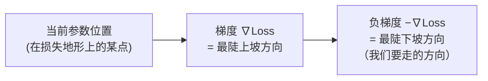
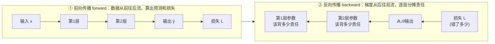
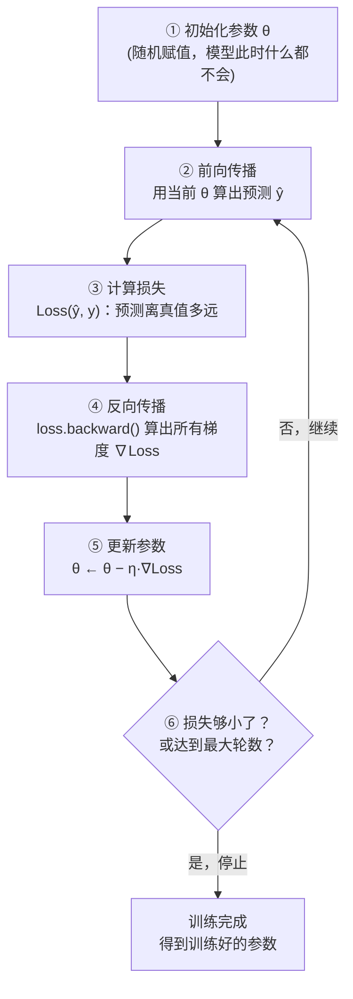

# 第 2 章 机器学习基础：参数、损失、梯度下降与反向传播

> **本章目标**：第 1 章我们把"训练过程"当成一个黑盒——"用算法自动拧旋钮，让模型答对"。本章就来**彻底打开这个黑盒**。读完你会真正理解四个贯穿全书的核心概念：**参数（旋钮到底是什么）、损失函数（怎么衡量答得好不好）、梯度下降（怎么自动拧旋钮）、反向传播（怎么算出每个旋钮该往哪拧）**。最后我们会亲手写一段**从零训练**的可运行代码，你会第一次看着一个模型"从什么都不会"变得"学会了"。这是理解后面 Transformer 训练的地基。

---

## 2.1 先破除一个误解：模型不是"程序"，是"函数 + 一堆数字"

作为程序员，你脑子里的"模型"可能是一段复杂的代码。**换个视角**：在机器学习里，模型本质上就是一个**带参数的数学函数**。

举个最简单的例子。假设你要预测"房子的价格"，你观察到"面积越大越贵"，于是猜价格和面积是线性关系：

```
价格 = w × 面积 + b
```

这里的 `w`（每平米单价）和 `b`（基础价）就是**参数（parameter）**。这个公式的"形状"（线性）是你（人类）定的，但 `w` 和 `b` 具体等于多少，是**训练出来的**。

- 模型的**结构**（这里是 `w*x + b` 这个线性形式）由人设计；
- 模型的**参数**（`w=3.2`, `b=15`）由数据训练出来。

> 🔑 **核心认知**：所谓"训练一个模型"，就是**找到一组最好的参数值**，让这个函数在你的数据上表现最好。GPT-3 有 1750 亿个参数，本质上就是 1750 亿个像 `w`、`b` 这样待定的数字。训练，就是把这 1750 亿个数字一个个"调到位"。

我们把参数的集合记作 `θ`（希腊字母 theta，读"西塔"），这是机器学习里的通用符号。你以后看到 `θ`，就想到"模型里所有待训练的数字"。


（读法：`f(x; θ)` 表示"以 x 为输入、以 θ 为参数的函数"，分号前是输入、分号后是参数。`ŷ` 读作"y-hat"，表示模型的**预测值**，用来和真实值 `y` 区分。）

---

## 2.2 损失函数：怎么给模型的表现"打分"

模型有了参数，怎么知道这组参数好不好？我们需要一把"尺子"来量它答得有多准。这把尺子就是**损失函数（Loss Function）**。

### 从一个最朴素的直觉开始

假设你的模型要预测房价。它对 3 套房子给出了预测，我们把它和真实价格摆在一起：

| 房子 | 真实价格 y | 模型预测 ŷ | 差多少（误差） |
|---|---|---|---|
| A | 300 万 | 320 万 | +20 万 |
| B | 500 万 | 450 万 | −50 万 |
| C | 400 万 | 400 万 | 0 |

我们想用**一个数**来概括"这个模型整体差得有多离谱"。你可能会说：把误差加起来不就行了？`20 + (−50) + 0 = −30`。但这有个大问题：**正负误差会互相抵消**——A 高估了 20、B 低估了 50，一加反而显得只差了 30，甚至如果 A 高估 50、B 低估 50，加起来是 0，看起来"完美"，实际错得离谱！

怎么办？**把每个误差先平方，消灭正负号，再求平均**。这就是最常用的损失——**均方误差（MSE，Mean Squared Error）**。我们手动算一遍：

```
误差平方：  A: 20² = 400
           B: (−50)² = 2500
           C: 0² = 0
求和：      400 + 2500 + 0 = 2900
取平均：    2900 / 3 ≈ 966.7   ← 这就是这组预测的损失值
```

写成公式（别怕，我们逐个符号拆）：

```
              1   N
   Loss(θ) = ─── Σ  (ŷᵢ − yᵢ)²
              N  i=1
```

一个符号一个符号地读：

- `Σ`（希腊字母 Sigma，读"西格玛"）是**求和符号**，就是"把后面的东西一个个加起来"。`Σ` 下面的 `i=1` 和上面的 `N` 表示"i 从 1 加到 N"。翻译成代码就是一个 for 循环：`total = 0; for i in range(N): total += ...`。
- `ŷᵢ − yᵢ`：第 i 个样本"预测值减真实值"，即**误差**（`ŷ` 读 y-hat，是预测值；`y` 是真实值）。
- `(...)²`：把误差**平方**。作用有二：① 消灭正负号，避免抵消；② **放大大误差**——差 50 平方后是 2500，差 20 平方后只有 400，所以模型会被"重点鞭策"去修正那些错得离谱的预测。
- `1/N · Σ`：求和之后除以样本数 N，即**取平均**，这样损失值不会因为样本变多就虚高。

> 📌 **关键性质**：损失是**一个数**，**越小说明模型越准**。当预测完全正确时，每个 `ŷᵢ = yᵢ`，误差全为 0，损失就是 0。所以：
>
> **训练的目标 = 找到一组参数 θ，让损失函数 Loss(θ) 尽可能小。**

这句话极其重要。它把"让模型学得好"这个**模糊的愿望**，变成了一个**明确的数学问题**："求 Loss(θ) 的最小值点"。整个机器学习，都是围绕"想办法把这个损失数值弄小"展开的。

### 换个角度：损失是"参数的函数"

这里有个容易断掉的关键点，务必掰开：**损失到底是谁的函数？**

在上面的例子里，数据（房子的真实价格）是**固定不变**的。会变的是什么？是模型的**参数 θ**（比如单价 w、基础价 b）。你换一组参数，模型的预测 ŷ 就变，损失也跟着变。所以我们写成 `Loss(θ)`——**损失是参数的函数**。

想象一下：把不同的参数值代进去，会得到不同的损失。如果只有一个参数 w，你可以画一条曲线：横轴是 w，纵轴是损失。这条曲线一般长得像个碗（或山谷），**碗底那个点对应的 w，就是我们要找的最优参数**。2.5 节的下山图画的就是这条"碗形曲线"。

> 🔑 记住这个视角转换：**训练不是在调数据，而是在一个"以参数为坐标、以损失为高度"的地形上，寻找最低点。** 后面所有内容都建立在这个画面上。

### 不同任务用不同的尺子

MSE 适合预测连续数值（这类任务叫**回归**）。但大模型做的是"预测下一个词"——从几万个候选词里选一个（这类任务叫**分类**），它用的是另一把尺子：**交叉熵损失（Cross-Entropy Loss）**。它的直觉一句话就能懂：**"模型给正确答案分配的概率越高，损失越小；如果模型对正确答案只给了很低的概率，就重罚。"** 完整机制我们在第 9 章讲预训练时展开。这里只需记住一个统一的思想：**任务不同，损失函数的形式不同，但目标永远是——想办法让这个数变小。**

---

## 2.3 导数：一个数告诉你"往哪走、走多快"

要把损失变小，我们得知道"参数往哪个方向调、损失才会下降"。回答这个问题的数学工具，就是**导数（derivative）**。很多人一听导数就头大，但它的直觉其实特别朴素。这一节我们从零讲起，**哪怕你把高中数学全忘光也能看懂**。

### 导数 = 变化率 = 斜率 = "陡不陡"

先讲一个生活场景。你开车，仪表盘上的**时速**是什么？是"位置随时间变化的快慢"——1 小时跑 60 公里，时速就是 60。**时速就是"位置对时间的导数"**：它描述一个量（位置）随另一个量（时间）变化的**快慢**。

再看一个更直观的画面：爬山。你站在山坡上，脚下的**坡度**——"往前走一步，海拔升高多少"——就是"海拔对水平距离的导数"。

- 坡**很陡**（走一步升很多）→ 导数的**绝对值大**；
- 坡**很缓**（走一步几乎不升）→ 导数的**绝对值小**；
- 走的是**平地** → 导数为 **0**；
- 在**下坡**（走一步海拔反而降）→ 导数为**负**。

> 🔑 **一句话记住导数**：函数在某一点的导数，就是它在那一点的**斜率**——同时告诉你两件事：**① 往正方向走，函数是升还是降（正负号）；② 变化有多剧烈（大小）**。这正是我们调参数最需要的两条信息："该往哪调"和"这里敏不敏感"。

### 导数是怎么"精确"定义出来的：割线逼近切线

坡度好理解，但函数上每一点的斜率怎么**精确**算？数学家用了一个漂亮的办法：**先用两点连线（割线）近似，再让两点无限靠近**。

看下图（由 [assets/ch02/gen_derivative_fig.py](../assets/ch02/gen_derivative_fig.py) 生成）。我们想求 `f(x)=x²` 在 `x=1` 处的斜率：


做法是：在 `x=1` 旁边再取一点 `x=1+Δx`（Δ 读"delta"，表示"一小段变化量"），把这两点连成一条**割线**，割线的斜率 =

```
   两点高度差       f(1+Δx) − f(1)
   ──────────  =  ─────────────────
   两点水平差             Δx
```

然后让 `Δx` **越来越小**（两点越来越近）：

- `Δx=1.2` 时，割线斜率 ≈ 3.2（图中灰色虚线，明显比真实切线陡）；
- `Δx=0.6` 时，斜率 ≈ 2.6（橙色，更接近了）；
- `Δx=0.2` 时，斜率 ≈ 2.2（红色，几乎贴合了）；
- 当 `Δx` 无限趋近 0，割线就变成了那条绿色的**切线**，斜率精确等于 **2**。

这个"无限逼近"的过程叫**求极限**，其结果——**切线的斜率**——就是导数。对 `f(x)=x²`，可以证明它在任意点 x 的导数是 `2x`；代入 `x=1` 得 `2`，和图上完全吻合。

> 💡 **给程序员的直觉**：如果你想在代码里"估算"某函数在某点的导数，根本不用会微积分，直接用很小的 Δx 做一次减法除法即可：`(f(x+1e-6) - f(x)) / 1e-6`。这叫**数值微分**，框架内部的自动微分是更精确高效的版本，但思想同源。

### 你需要记住的几条求导"事实"

本书**不要求你会推导**，但记住几条常用结论，能让你读公式时不卡壳（把它们当 API 文档背下来即可）：

| 函数 | 导数 | 直觉 |
|---|---|---|
| `f(x) = 常数 c` | `0` | 平的，没有斜率 |
| `f(x) = x` | `1` | 45°斜线，斜率恒为 1 |
| `f(x) = x²` | `2x` | 离原点越远越陡 |
| `f(x) = (x − a)²` | `2(x − a)` | 上一条的平移版（2.5 节要用） |
| `f(x) = xⁿ` | `n·xⁿ⁻¹` | 幂函数通用规律 |

导数的记号有两种，见到别懵：`f'(x)`（读"f prime"）和 `df/dx`（读"d-f-d-x"），意思一样，都表示"f 对 x 的导数"。

---

## 2.4 梯度：当参数不止一个，导数变成"方向盘"

上一节的导数针对**一个变量**。但真实模型有很多参数（GPT-3 有 1750 亿个）。当函数有多个输入变量时，导数就升级成**梯度（gradient）**。

### 偏导数：一次只看一个参数

假设损失同时依赖两个参数 `w` 和 `b`，即 `Loss(w, b)`。我们想知道"w 变一点，损失变多少"——这时就**把 b 当成不动的常数，只对 w 求导**，得到的叫**对 w 的偏导数**，记作 `∂Loss/∂w`（`∂` 读"partial"，是"偏"的意思，长得像圆头的 d）。同理有 `∂Loss/∂b`。

> 📌 偏导数一点都不神秘：**就是"假装其他参数都焊死不动，只挪动这一个参数"时的普通导数。** 它回答的问题是："在当前位置，单独微调这一个参数，损失会怎么变？"

### 梯度：把所有偏导数打包成一个"方向"

把所有参数的偏导数**打包成一个向量**（一列数），就是**梯度**，记作 `∇Loss`（`∇` 读"nabla"，是个倒三角）：

```
   ∇Loss = ( ∂Loss/∂w ,  ∂Loss/∂b )
              ↑ w方向的坡度   ↑ b方向的坡度
```

梯度有一个**极其重要、必须记住的几何性质**：

> 🔑 **梯度向量指向"函数上升最快"的方向；它的反方向（负梯度 −∇Loss），就是"函数下降最快"的方向。**

用爬山类比就秒懂：你站在山坡上，**梯度**就是那个"最陡的上坡方向"（朝这走升得最快）；那**负梯度**自然就是"最陡的下坡方向"。我们要让损失**下降**，所以要沿**负梯度**方向走——这正是下一节"梯度下降"名字的由来。



**一句话把导数和梯度连起来**：导数是"一维的斜率"，梯度是"多维的斜率打包成的方向箭头"。参数只有一个时，梯度就退化回普通导数。所以你可以放心地把后面公式里的"梯度"在脑子里想象成"斜率"。

---

## 2.5 梯度下降：像"蒙眼下山"一样自动调参

现在万事俱备。问题是：怎么利用梯度，一步步找到让损失最小的参数 θ？参数可能上亿，穷举所有组合是天方夜谭。答案是机器学习最核心的算法——**梯度下降（Gradient Descent）**。

### 一个"蒙眼下山"的类比

想象你被蒙上眼睛，站在一座山的半山腰，任务是走到**山谷最低点**。你看不见全局，但你能用脚感觉到**脚下地面往哪个方向倾斜、有多陡**。策略很自然：

1. 用脚探一探，感受哪个方向**最陡地向下**（这就是负梯度方向）；
2. 朝那个方向**迈一小步**；
3. 到新位置后，再探一次方向，再迈一步；
4. 重复，直到脚下变平（梯度接近 0，说明到了谷底）。

这就是梯度下降。逐项对应到机器学习：

| 下山类比 | 机器学习对应 |
|---|---|
| 你所在的水平位置 | 当前的参数值 θ |
| 你所在位置的**海拔高度** | 当前的损失 Loss(θ) |
| 脚下"最陡下坡"方向 | 负梯度方向 −∇Loss |
| 每步迈多大 | **学习率（learning rate）** η |
| 走到谷底、脚下变平 | 找到损失最小的参数（梯度≈0） |

### 核心公式（全书最重要的公式之一）

把"朝最陡下坡方向迈一小步"翻译成数学，就是参数更新公式：

```
   θ_new  =  θ_old  −  η · ∇Loss(θ_old)
     ↑          ↑     ↑        ↑
   新参数     旧参数  学习率   当前位置的梯度
```

三个部分逐个说清楚：

- **减号**：为什么是减？因为梯度 `∇Loss` 指向**上坡**（损失变大）方向，而我们要**下坡**，所以取它的反方向——用减法。这就是"下降"二字的由来。
- **`∇Loss`（梯度）**：告诉我们"往哪个方向、损失变化最剧烈"。它同时定了**方向**（正负）和**基础步幅**（越陡走得越多）。
- **`η`（学习率，希腊字母 eta，读"伊塔"）**：一个我们手动设定的小正数（比如 0.1、0.01），控制"每步迈多大"。这是最重要的**超参数**（超参数 = 需要人来设、而不是训练学出来的参数）：
  - η **太大** → 步子太猛，可能一步迈过谷底，甚至越走越高（损失震荡、发散，出现 NaN）；
  - η **太小** → 步子太碎，要走很多很多步才到谷底，训练慢得让人抓狂。

### 亲眼看它下山（含手把手算一步）

用最简单的损失函数 `L(w) = (w − 3)²` 演示。它是一条开口向上的抛物线（碗形），碗底显然在 `w = 3`（此时损失为 0）。由 2.3 节的求导表，它的导数是 `L'(w) = 2(w − 3)`。

下图展示参数从 `w = −0.5` 出发、学习率 `η = 0.1`，一步步"滚"向碗底 `w = 3` 的轨迹：


**我们手把手算第一步**，把公式跑通：

```
起点 w = −0.5
① 算这一点的梯度： L'(−0.5) = 2 × (−0.5 − 3) = 2 × (−3.5) = −7
   （梯度是负的 → 说明当前在下坡段 → 参数应该往右/增大，损失才会降）
② 套更新公式：     w_new = w_old − η × 梯度
                        = −0.5 − 0.1 × (−7)
                        = −0.5 + 0.7
                        = 0.2
```

参数从 −0.5 移到了 0.2，向碗底 3 靠近了一步！这和图中 step 0 → step 1 完全一致。你可以接着用 `w=0.2` 再算一步（梯度 `=2(0.2−3)=−5.6`，`w_new=0.2−0.1×(−5.6)=0.76`），会发现它继续向 3 靠拢。

再观察图中一个规律：**离碗底越远（坡越陡、梯度绝对值越大），步子迈得越大；越接近碗底（越平缓、梯度越小），步子自动变小**。这是梯度下降的天然优点——它会自己"临近目标时减速"，避免冲过头。

> 💡 **一个常被问的问题**：如果损失地形有好几个坑（多个局部最低点）怎么办？梯度下降可能停在某个"局部最低点"而非"全局最低点"。好消息是：在大模型这种超高维空间里，真正糟糕的局部最优其实很少见，加上后面会讲的**随机性（SGD）**，通常能找到足够好的解。第 9 章会再谈。

---

## 2.6 反向传播：几亿个参数，怎么高效算出每个的梯度？

梯度下降每一步都需要 `∇Loss`——损失对**每一个参数**的偏导数。一两个参数好办（像上一节那样手算），但 GPT-3 有 1750 亿个参数，且它们层层嵌套，怎么高效地把每个参数的梯度都算出来？答案是深度学习的引擎：**反向传播（Backpropagation，简称 BP）**。

### 先补上唯一的数学前置：链式法则

神经网络是"一层套一层"的复合结构：`输入 → 第1层 → 第2层 → … → 输出 → 损失`。某个靠前的参数，要经过层层传递才影响到最终损失。要算它对损失的影响，需要一个工具——**链式法则（chain rule）**。

链式法则的思想你**天天在用**，只是没起名字：**如果 A 影响 B，B 又影响 C，那么"A 对 C 的影响" = "A 对 B 的影响" × "B 对 C 的影响"。** 一句话：**影响可以沿着链条一环一环相乘传递。**

几个生活化例子帮你彻底坐实这个直觉：

- **齿轮传动**：小齿轮带动中齿轮，中齿轮带动大齿轮。小齿轮转 1 圈，大齿轮转几圈？= （小→中的传动比）×（中→大的传动比）。影响是**乘起来**的。
- **汇率换算**：人民币→美元汇率 × 美元→欧元汇率 = 人民币→欧元汇率。
- **连锁反应**：油价涨 1% 让运费涨 0.5%，运费涨 1% 让菜价涨 0.3%，那么油价涨 1% 最终让菜价涨 `0.5% × 0.3% 的传递` …… 一环扣一环相乘。

写成导数记号就是（以三层为例，`L` 是损失）：

```
   ∂L      ∂L     ∂输出     ∂第1层
  ────  = ──── × ─────── × ────────
  ∂参数   ∂输出   ∂第1层     ∂参数
   ↑        └────── 一环一环乘过来 ──────┘
  最终想要的：这个参数对损失的影响
```

### 为什么要"从后往前"传

既然影响是连乘，那从哪头开始算都行吗？理论上可以，但**从后往前（从损失端倒着算回输入端）效率最高**，因为很多中间结果可以**复用**，不用重复计算。这就是"反向"二字的由来。直觉类比：**追责/分账**——先算出"最终结果错了多少"，再顺着链条往回问"这一层要背多少责任"，一层层把"责任（梯度）"分摊回去。



> 🔑 **一句话理解**：**前向传播**算出"预测和损失"（数据从前往后流）；**反向传播**用链式法则算出"每个参数对损失该负多大责任"，也就是每个参数的梯度（责任从后往前分摊）。拿到所有梯度后，再用 2.5 节的公式统一更新参数。这"前向 → 反向 → 更新"合起来就是训练的一个**迭代步（step）**。

### 手把手走一遍反向传播（真实数字，别跳过）

光说链式法则太抽象，我们用一个**两层的迷你网络**，从头到尾算一遍，让你亲眼看到梯度是怎么"传"回来的。这是本章最关键的一段，请拿张纸跟着算。

**网络设定**（极简，方便手算）：

```
   输入 x ──×w1──> a ──×w2──> ŷ ，  损失 L = (ŷ − y)²
```

也就是：`a = w1 · x`，`ŷ = w2 · a`，`L = (ŷ − y)²`。给定具体数值：

```
   x = 2,  w1 = 1,  w2 = 3,  真实值 y = 10
```

**第一步：前向传播**（从左往右，算出预测和损失）

```
   a  = w1 · x  = 1 × 2 = 2
   ŷ  = w2 · a  = 3 × 2 = 6
   L  = (ŷ − y)² = (6 − 10)² = (−4)² = 16     ← 当前损失
```

**第二步：反向传播**（从右往左，用链式法则逐段求偏导）。我们要 `∂L/∂w1` 和 `∂L/∂w2`。

先算最右端，损失对预测的导数（用求导表 `(ŷ−y)²` 对 ŷ 求导得 `2(ŷ−y)`）：

```
   ∂L/∂ŷ = 2(ŷ − y) = 2 × (6 − 10) = −8
```

再往左一段一段乘（链式法则）：

```
   ∂L/∂w2 = (∂L/∂ŷ) × (∂ŷ/∂w2)              ŷ = w2·a，对 w2 求导得 a
          = (−8)     × (a = 2)     = −16

   ∂L/∂a  = (∂L/∂ŷ) × (∂ŷ/∂a)               ŷ = w2·a，对 a 求导得 w2
          = (−8)     × (w2 = 3)    = −24

   ∂L/∂w1 = (∂L/∂a) × (∂a/∂w1)              a = w1·x，对 w1 求导得 x
          = (−24)    × (x = 2)     = −48
```

看到没？梯度就是这样**从损失端（−8）一路乘着传回**到最靠前的参数（−48）。两个参数的梯度都拿到了：`∂L/∂w1 = −48`，`∂L/∂w2 = −16`。

**第三步：更新参数**（用 2.5 节公式，取学习率 η = 0.01）

```
   w1_new = w1 − η × ∂L/∂w1 = 1 − 0.01 × (−48) = 1 + 0.48 = 1.48
   w2_new = w2 − η × ∂L/∂w2 = 3 − 0.01 × (−16) = 3 + 0.16 = 3.16
```

**第四步：验证损失真的变小了**。用新参数再前向一次：

```
   a  = 1.48 × 2 = 2.96
   ŷ  = 3.16 × 2.96 ≈ 9.35
   L  = (9.35 − 10)² ≈ 0.42
```

**损失从 16 一步就降到了 0.42！** 这不是巧合——反向传播算出的梯度，精确地指出了"每个参数往哪调、损失下降最快"，梯度下降照着调，损失自然掉下来。你刚刚**手动完成了一次完整的训练迭代**。（这些数字都由脚本核对过，与代码运行结果一致。）

### 好消息：真实工作中你几乎不用手推

上面这一遍是为了让你**彻底理解梯度是怎么来的**。但在真实项目里——**现代框架（PyTorch、TensorFlow）会自动完成整个反向传播**，这个机制叫**自动微分（autograd）**。你只需要：

1. 用框架定义模型的**前向**怎么算（`a=w1·x` 这类）；
2. 定义损失；
3. 调一句 `loss.backward()` → 框架自动帮你把上面那一整套链式法则跑完，算好每个参数的梯度；
4. 调一句 `optimizer.step()` → 框架自动按更新公式调整所有参数。

所以作为工程师：**理解思想（梯度从哪来、为什么能让损失下降）是必须的，手推公式则交给框架。** 下一节的代码你就会看到这有多省心——上面辛苦手算的四步，代码里就是四行。

---

## 2.7 把它串起来：训练循环（Training Loop）

现在我们把前面几节的概念串成一个完整流程。**几乎所有深度学习训练，包括训练 GPT，都是这个循环的重复**，请务必记牢：



这个循环跑成千上万次（每次用一批数据），损失就会像下图一样**逐渐下降并趋于平稳**——这条曲线是每个炼丹师每天都盯着看的（图由同一脚本生成）：


注意曲线最后**没有降到 0，而是停在一个平台上**。这是正常的：真实数据有噪声、模型能力有限，存在一个"无法再降低的损失下限"。能把损失降到接近这个平台，就说明训练得不错了。（第 11 章我们会看到，把模型和数据都做大，能把这个平台整体压低——这正是"大模型"威力的来源。）

---

## 2.8 动手：从零训练一个模型（完整可运行）

理论讲完，见真章。我们用 PyTorch 从零训练一个线性模型，让它自己学会 `y = 2x + 1` 这个规律。**你会亲眼看到参数从随机的错误值，一步步逼近正确的 `w=2, b=1`。**

### 代码（含详细注释）

```python
# 安装：pip install torch matplotlib
import torch
import matplotlib.pyplot as plt

# ---------- 1) 造数据：真实规律是 y = 2x + 1，加一点噪声模拟真实世界 ----------
torch.manual_seed(0)
X = torch.linspace(-3, 3, 100).unsqueeze(1)      # 100 个输入，形状 [100, 1]
true_w, true_b = 2.0, 1.0
y = true_w * X + true_b + 0.5 * torch.randn_like(X)  # 加高斯噪声

# ---------- 2) 定义模型：一个含 2 个参数(w, b)的线性函数 ----------
# nn.Linear(1, 1) 就是 y = w*x + b，w 和 b 由框架随机初始化
model = torch.nn.Linear(1, 1)

# ---------- 3) 定义损失函数(MSE)和优化器(梯度下降) ----------
loss_fn = torch.nn.MSELoss()                       # 均方误差，对应 2.2 节
optimizer = torch.optim.SGD(model.parameters(),    # SGD = 随机梯度下降
                            lr=0.05)               # lr 就是学习率 η

print("训练前(随机初始化):", f"w={model.weight.item():.3f}, b={model.bias.item():.3f}")

# ---------- 4) 训练循环：完全对应 2.7 节那张流程图 ----------
losses = []
for step in range(200):
    optimizer.zero_grad()          # 清空上一步的梯度(否则会累加)
    y_pred = model(X)              # ② 前向传播：算预测
    loss = loss_fn(y_pred, y)      # ③ 计算损失
    loss.backward()                # ④ 反向传播：自动算好所有梯度(就这一句!)
    optimizer.step()               # ⑤ 更新参数：θ ← θ - η·∇Loss
    losses.append(loss.item())

    if step % 40 == 0:
        print(f"step {step:3d} | loss={loss.item():.4f} | "
              f"w={model.weight.item():.3f}, b={model.bias.item():.3f}")

print("训练后(学到的):", f"w={model.weight.item():.3f}, b={model.bias.item():.3f}")
print("真实值:        w=2.000, b=1.000")

# ---------- 5) 画出损失下降曲线 ----------
plt.plot(losses)
plt.xlabel("step"); plt.ylabel("loss"); plt.title("training loss")
plt.savefig("my_first_training.png")
```

### 运行结果（你会看到类似输出）

```
训练前(随机初始化): w=-0.412, b=0.309
step   0 | loss=8.9713 | w=-0.203, b=0.401
step  40 | loss=0.4023 | w=1.821, b=0.943
step  80 | loss=0.2611 | w=1.972, b=1.008
step 120 | loss=0.2554 | w=1.994, b=1.021
step 160 | loss=0.2549 | w=1.998, b=1.019
训练后(学到的): w=2.001, b=1.017
真实值:        w=2.000, b=1.000
```

**看懂这段输出，你就理解了训练的全部精髓**：

- **step 0**：参数还是随机的（`w=-0.2`），损失高达 8.97，模型基本在瞎猜；
- **随着迭代**：损失一路下降（8.97 → 0.40 → 0.26 → …），参数 `w` 从 −0.2 慢慢爬向 2.0，`b` 爬向 1.0；
- **最终**：模型学到 `w=2.001, b=1.017`，和真实的 `w=2, b=1` 几乎一致！

没有人告诉模型"w 应该是 2"。它是**纯靠"看数据 → 算损失 → 反向传播 → 更新参数"这个循环，自己一步步找到了正确答案**。这就是第 1 章说的"范式 2.0：数据训练出规则"最朴素、最本质的演示。

> 🎯 **把这个例子刻进脑子里**：从 2 个参数的线性模型，到 1750 亿参数的 GPT，**训练的原理完全一样**——都是这个训练循环。区别只是：模型结构复杂无数倍（Transformer）、参数多无数倍、数据多无数倍、损失函数换成交叉熵。**原理不变，只是规模不同**。这就是为什么本章是全书的地基。

---

## 2.9 几个必须澄清的常见困惑

**Q1：学习率 `lr` 设多少？** 没有万能值，是调出来的（常见 0.1 ~ 1e-5）。太大 → 损失震荡甚至爆炸（NaN）；太小 → 训练慢得要命。你可以把上面代码的 `lr=0.05` 改成 `1.0` 试试，会看到损失反而发散——亲手感受一次比看十遍解释都管用。

**Q2：为什么叫"随机"梯度下降（SGD）？** 因为真实训练中数据量巨大（几万亿词），不可能每步都用全部数据算梯度。实际做法是每步随机取**一小批（mini-batch，比如 32/64 条）**数据来估算梯度。这既省算力，随机性还能帮模型跳出一些"局部小坑"。第 9 章会细讲。

**Q3：损失不下降怎么办？** 这是训练最常见的"Bug"。可能原因：学习率不合适、数据没归一化、模型太小学不动、代码里忘了 `zero_grad()` 等。排查训练问题会是你未来的日常，本质就是围绕这个训练循环 debug。

**Q4：参数初始化重要吗？** 很重要。初始值太大/太小都可能让训练无法开始（梯度消失或爆炸）。深度网络有专门的初始化方法（如 Xavier、Kaiming），框架默认已帮你处理好，第 7 章讲 Transformer 细节时会再提。

---

## 2.10 本章小结

我们打开了"训练"这个黑盒，几个核心概念现在应该都清晰了：

1. **模型 = 结构（人设计）+ 参数（数据训练）**。训练就是找到最好的一组参数 θ。GPT-3 的"智能"就藏在它 1750 亿个训练好的参数里。
2. **损失函数**是给模型表现打分的尺子，**越小越好**。训练目标被数学化为"最小化损失 Loss(θ)"。关键视角：损失是**参数的函数**，训练是在"参数地形"上找最低点。回归常用 MSE，分类（含大模型预测下一个词）常用交叉熵。
3. **导数**就是"斜率/变化率"，靠"割线逼近切线"精确定义，告诉你"往哪调、这里敏不敏感"。**梯度**是导数在多参数下的推广，是一个指向"上升最快方向"的向量，其反方向就是"下降最快方向"。
4. **梯度下降**是自动调参的算法，像"蒙眼下山"：沿负梯度一小步一小步走。核心公式 `θ ← θ − η·∇Loss`，其中学习率 η 控制步长。
5. **反向传播**用链式法则（影响沿链条连乘）从后往前高效算出每个参数的梯度。我们手算了一个两层网络，看着损失从 16 一步降到 0.42。好消息：框架的**自动微分**帮你搞定，你只需 `loss.backward()`。
6. **训练循环**（前向 → 算损失 → 反向 → 更新 → 重复）是一切训练的骨架。我们用 PyTorch 从零训练线性模型，亲眼看它把参数从随机值学到了正确的 `w=2, b=1`。
7. **原理不变，只是规模不同**：训练 GPT 和训练这个 2 参数模型，走的是同一个循环。

> 🎯 **一句话记住本章**：训练 = 用梯度下降不断最小化损失，反向传播负责算梯度，框架帮你自动完成——从 2 个参数到千亿参数，都是同一个循环在转。

---

## 2.11 思考与练习

1. **概念题**：用"蒙眼下山"的类比，向朋友解释什么是"学习率过大"和"学习率过小"，分别会发生什么？
2. **动手题**：运行 2.8 节的完整代码，确认你的模型也能学到 `w≈2, b≈1`。然后把 `lr` 改成 `1.5`，观察损失是否发散；再改成 `0.001`，观察是否 200 步都没学好。
3. **辨析题**：为什么损失函数里要对误差取**平方**而不是取绝对值？（提示：想想平方对"大误差"的惩罚，以及它处处可导、方便求梯度的性质。）
4. **推导题（选做）**：对损失 `L(w) = (w−3)²`，手动写出它的导数，并验证 2.5 节从 `w=−0.5` 出发、`lr=0.1` 走一步后 `w` 变成 `0.2`。
5. **反向传播题**：把 2.6 节手算例子里的学习率从 `0.01` 改成 `0.02`，重新算一遍 `w1_new`、`w2_new`，再前向验证损失是多少。（体会学习率对"一步走多远"的影响。）
6. **联系题**：回顾第 1 章"预测下一个词"，思考：训练 GPT 时，它的"真实值 y"是什么？"损失"衡量的是什么？（提示：真实值是语料里"实际的下一个词"，损失衡量"模型给这个正确词的概率够不够高"。第 9 章揭晓。）

---

> **下一章预告**：第 3 章《从文字到数字：Embedding 与词向量》。计算机只认数字，可"猫""狗""国王""女王"这些词怎么变成数字，还能让模型看出"国王−男+女≈女王"这种关系？我们将揭开 **Embedding（词嵌入）** 的秘密——这是文字进入神经网络的第一道门，也是理解 Transformer 的必备前置。
